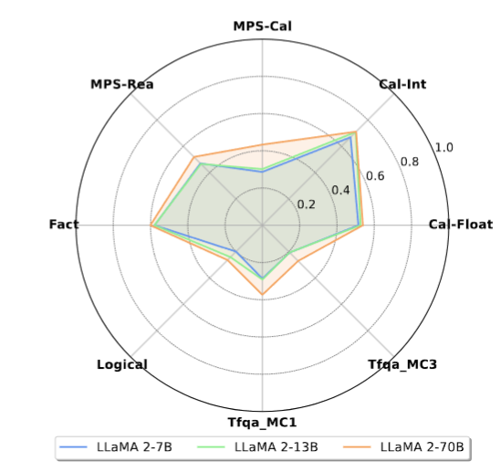
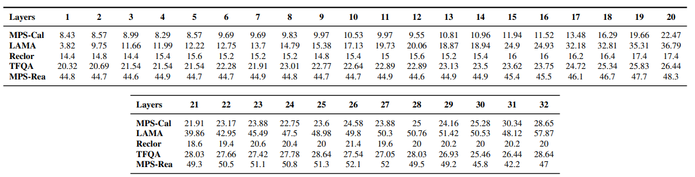
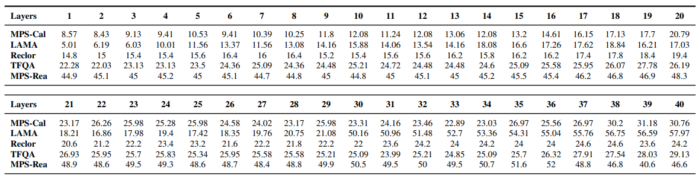
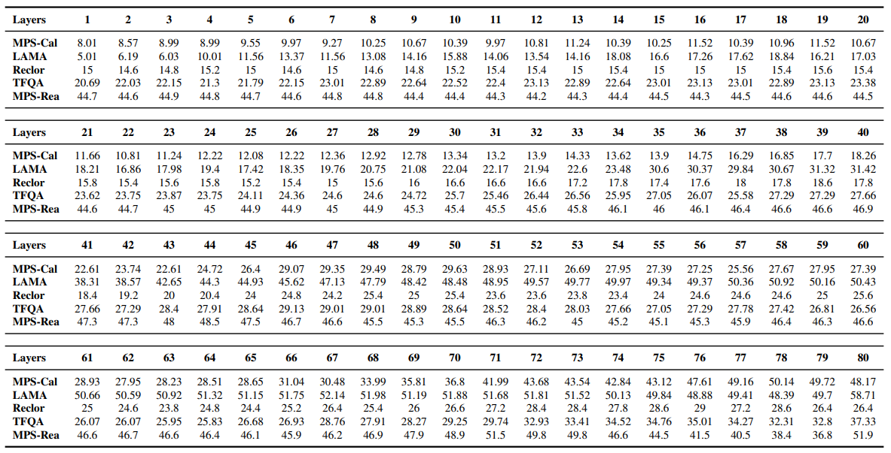
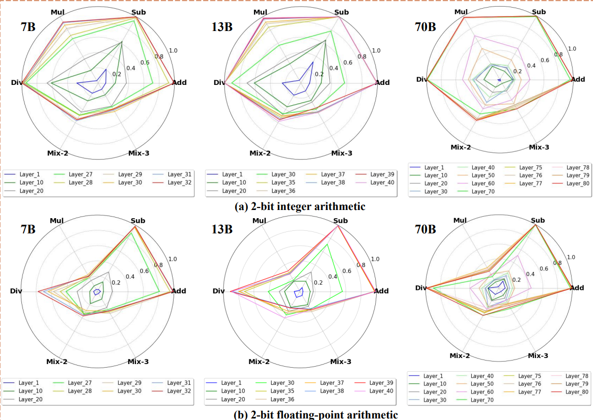
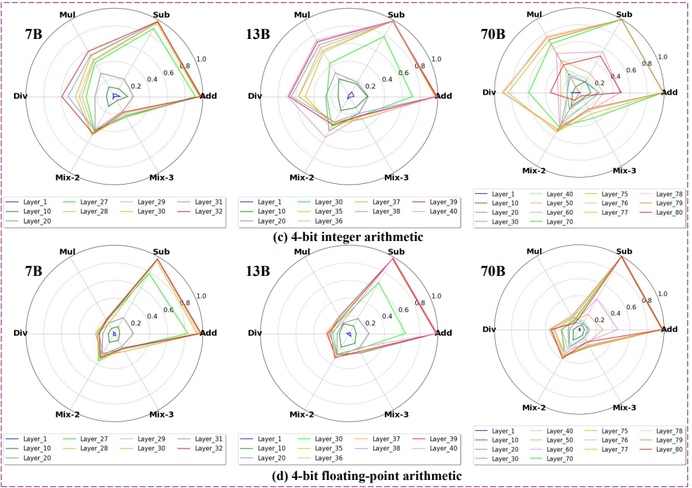
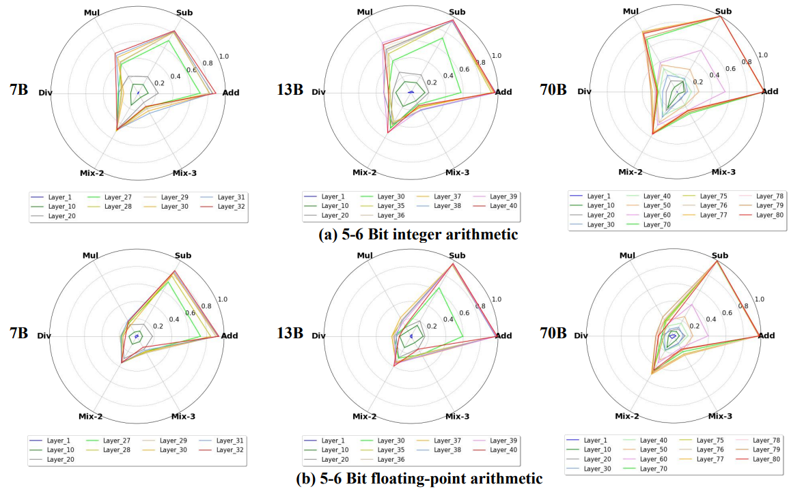
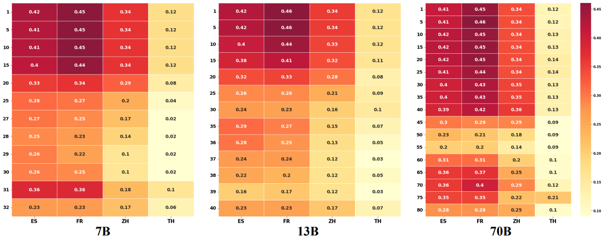
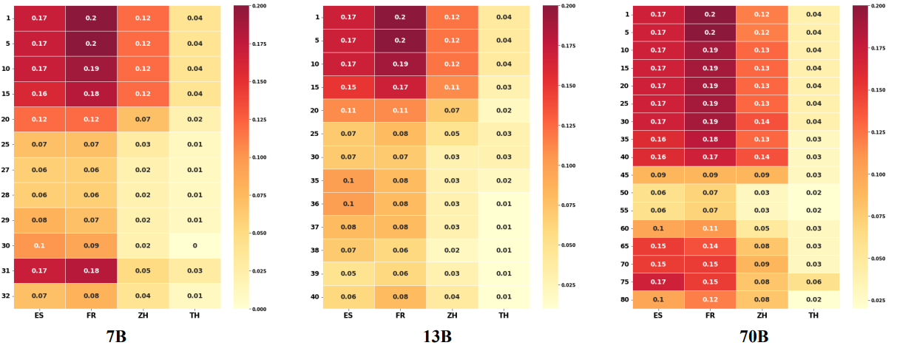

# Is Bigger and Deeper Always Better? Probing LLaMA Across Scales and Layers
This is official project in our paper: [**Is Bigger and Deeper Always Better? Probing LLaMA Across Scales and Layers**](https://arxiv.org/abs/2312.04333)

## Overview

This projects presents an in-depth analysis of Large Language Models (LLMs), focusing on LLaMA, a prominent open-source foundational model in natural language processing. 
Instead of assessing LLaMA through its generative output, we design multiple-choice tasks to probe its intrinsic understanding in high-order tasks such as reasoning and computation. We examine the model horizontally, comparing different sizes, and vertically, assessing different layers.

We probe the LLaMA models in six high-order tasks:

- **Calculation**
- **Math problem solving (MPS)**
- **Logical reasoning**
- **Truthfulness**
- **Factual knowledge detection**
- **Cross-lingual Reasoning**

We unveil several key and uncommon findings based on the designed probing tasks: 

-  Horizontally, enlarging model sizes almost could not automatically impart additional knowledge or computational prowess. Instead, it can enhance reasoning abilities, especially in math problem solving, and helps reduce hallucinations, but only beyond certain size thresholds;
    
-  In vertical analysis, the lower layers of LLaMA lack substantial arithmetic and factual knowledge, showcasing logical thinking, multilingual and recognitive abilities, with top layers housing most computational power and real-world knowledge.

We expect these findings provide new observations into LLaMA's capabilities, offering insights into the current state of LLMs.


## Quick Links

- [Results](#results)
 - [Overall Probing](#overall-probing)
 - [7B Probing](#7b-probing)
 - [13B Probing](#13b-probing)
 - [70B Probing](#70b-probing)
 - [Calculation Probing](#calculation-probing)
   - [1-2Bit](#1-2Bit)
   - [3-4Bit](#3-4Bit)
   - [5-6Bit](#5-6Bit)
- [Cross-lingual Probing](#cross-lingual-probing)
- [Reproduce](#reproduce)
- [Citation](#citation)


## Results

### Overall Probing 

<p align="center">
  
</p>

### 7B Probing 

<p align="center">
  
</p>

### 13B Probing 

<p align="center">
  
</p>


### 70B Probing 

<p align="center">
  
</p>

### Calculation Probing

### 1-2Bit
<p align="center">
  
</p>

### 3-4Bit
<p align="center">
  
</p>

### 5-6Bit
<p align="center">
  
</p>

### Cross-lingual Probing

### XMPS-Rea
<p align="center">
  
</p>

### XMPS-Cal
<p align="center">
  
</p>

## Reproduce

### Dependency

```
pip install requirements.txt
```

### Math Problem Solving Probing

for each subtask: MPS-REA, MPS-CAL, XMPS-REA and XMPS-CAL, you should use corresponding data for probing.

```
bash test_math.sh
```


### Factual Knowledge Probing

We use a subset from LAMA as a testbed for our probing task.

```
bash test_factural.sh
```

### Truthfulness Probing

We use TrufulQA MC1 and MC3 tasks as a testbed for our probing task.

```
bash test_tfqa.sh
```

### Logical Reasoning Probing

We use the Reclor eval set as a testbed for our probing task.

```
bash test_logical.sh
```

## Citation

```
@article{chen2023beyond,
  title={Is Bigger and Deeper Always Better? Probing LLaMA Across Scales and Layers},
  author={Chen, Nuo and Wu, Ning and Liang, Shining and Gong, Ming and Shou, Linjun and Zhang, Dongmei and Li, Jia},
  journal={arXiv preprint arXiv:2312.04333},
  year={2023}
}
```


